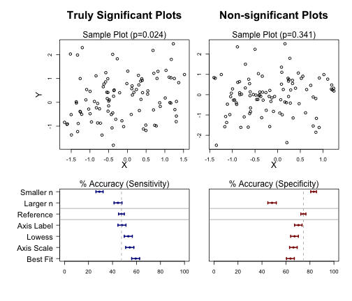
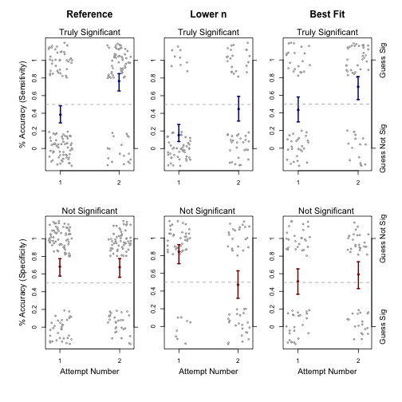

Supplemental Code
========================================================

This report was created using the knitr package (http://yihui.name/knitr/) in R (http://www.r-project.org/)


```r
# Initial Setup Note: Output from this code section has been masked for the
# sake of saving space.

library(plotrix)
library(lme4)

# Note to editor: Code book for these two files will be a part of the online
# supplement
x_full <- read.csv("coursera_user_responses.csv", header = TRUE)  #user responses to coursera questions.
load("data_for_1plots_coursera.RData")  #objects describing the library of plots shown to users.

logit <- function(x) log(x/(1 - x))
invLogit <- function(x) {
    out <- exp(x)/(1 + exp(x))  #maintains the ability of the function to accept vectors
    out[exp(x) == Inf] <- 1
    return(out)
}
```


```r
# Output from this section has been masked)

# Process x_full

# re-order the style factor's levels so the reference category is first
uStyle <- unique(c("n100ref", as.character(x_full$style)))
x_full$style <- factor(as.character(x_full$style), levels = uStyle)
x_full$datVer <- as.factor(as.numeric(x_full$datVer))
x_full$id <- as.factor(as.numeric(x_full$id))
x_full$attemptNumFactor <- as.factor(as.numeric(x_full$attemptNum))

# preview x_full
dim(x_full)  #x_full includes everything, including missing data
head(x_full)  #note: styleNum values 2 & 3 are actually the same question style
lapply(x_full[1, ], class)
N <- sum(!is.na(x_full$guessSig))
n <- sum(!duplicated(x_full$id[!is.na(x_full$guessSig)]))
K <- length(uStyle)
N  #total # responses
n  #total # users
K  #total # of question types

# Make a version without missing data
x <- x_full[!is.na(x_full$guessSig), ]

# Get number of answers for each question type
nStyle <- c(table(x$style))[uStyle]
nStyle


uStyle
pretty_style_labels <- c("Reference", "Smaller n", "Larger n", "Best Fit", "Axis Scale", 
    "Axis Label", "Outlier", "Lowess")  #for use in plots
```


Models for Baseline Accuracy, and Effect of Plot Presentation Style
-----------------


```r
# Just look at first attempts of the survey
attemptNum1Data <- x[x$attemptNum == 1, ]


# Using 2 separate models, one for sensitivity, one for specificity (sense &
# spec)
sum(attemptNum1Data$trueSig)  # number of responses used in sense model = 9063
```

```
## [1] 9063
```

```r
sum(!attemptNum1Data$trueSig)  # number of responses used in spec model = 9032
```

```
## [1] 9032
```

```r

glmmSense = glmer(correct ~ 1 + (1 | id) + style, data = attemptNum1Data[attemptNum1Data$trueSig, 
    ], family = "binomial")  #Sensitivity model
```

```
## Warning: Model failed to converge with max|grad| = 0.039379 (tol = 0.001)
```

```r
glmmSpec = glmer(correct ~ 1 + (1 | id) + style, data = attemptNum1Data[!attemptNum1Data$trueSig, 
    ], family = "binomial")  #Specificity model
```

```
## Warning: Model failed to converge with max|grad| = 0.00643088 (tol =
## 0.001)
```

```r

# Show basic output
print(glmmSense, correlation = FALSE)
```

```
## Generalized linear mixed model fit by maximum likelihood (Laplace
##   Approximation) [glmerMod]
##  Family: binomial ( logit )
## Formula: correct ~ 1 + (1 | id) + style
##    Data: attemptNum1Data[attemptNum1Data$trueSig, ]
##      AIC      BIC   logLik deviance df.resid 
##    12099    12163    -6041    12081     9054 
## Random effects:
##  Groups Name        Std.Dev.
##  id     (Intercept) 0.63    
## Number of obs: 9063, groups: id, 2036
## Fixed Effects:
##    (Intercept)        stylen35       stylen200    stylebestFit  
##         -0.103          -0.789          -0.116           0.480  
## styleaxesScale  styleaxesLabel    styleoutlier     stylelowess  
##          0.279           0.017           1.013           0.230
```

```r
print(glmmSpec, correlation = FALSE)
```

```
## Generalized linear mixed model fit by maximum likelihood (Laplace
##   Approximation) [glmerMod]
##  Family: binomial ( logit )
## Formula: correct ~ 1 + (1 | id) + style
##    Data: attemptNum1Data[!attemptNum1Data$trueSig, ]
##      AIC      BIC   logLik deviance df.resid 
##    11120    11184    -5551    11102     9023 
## Random effects:
##  Groups Name        Std.Dev.
##  id     (Intercept) 0.765   
## Number of obs: 9032, groups: id, 2032
## Fixed Effects:
##    (Intercept)        stylen35       stylen200    stylebestFit  
##          1.076           0.522          -1.139          -0.511  
## styleaxesScale  styleaxesLabel    styleoutlier     stylelowess  
##         -0.400          -0.209          -0.529          -0.357
```

```r

# Get odds ratios and CIs
getORCIs <- function(model) {
    # logit(E(Y))=X*Beta; odds(E(Y))=exp(X*Beta)
    modelCoef <- fixef(model)
    modelSe <- sqrt(diag(vcov(model)))  #std error
    fit <- exp(modelCoef)
    li <- exp(modelCoef - qnorm(0.975) * modelSe)
    ui <- exp(modelCoef + qnorm(0.975) * modelSe)
    signif(cbind(fit, li, ui), 3)
}
getORCIs(glmmSense)
```

```
##                  fit    li    ui
## (Intercept)    0.903 0.820 0.993
## stylen35       0.454 0.384 0.538
## stylen200      0.891 0.759 1.040
## stylebestFit   1.620 1.370 1.900
## styleaxesScale 1.320 1.120 1.560
## styleaxesLabel 1.020 0.867 1.190
## styleoutlier   2.750 2.330 3.260
## stylelowess    1.260 1.070 1.480
```

```r
getORCIs(glmmSpec)
```

```
##                  fit    li    ui
## (Intercept)    2.930 2.630 3.270
## stylen35       1.690 1.390 2.040
## stylen200      0.320 0.269 0.381
## stylebestFit   0.600 0.506 0.713
## styleaxesScale 0.670 0.565 0.795
## styleaxesLabel 0.811 0.680 0.969
## styleoutlier   0.589 0.495 0.701
## stylelowess    0.700 0.588 0.833
```

```r

# Show variance explained by the random intercepts in each model Works
# specifically for binomial models
get_var_explained_by_rand_int <- function(model) {
    G <- attr(VarCorr(model)$id, "stddev")^2
    return(G/(G + (pi^2)/3))
}
# get_var_explained_by_rand_int(glmmInt)
get_var_explained_by_rand_int(glmmSense)
```

```
## (Intercept) 
##      0.1077
```

```r
get_var_explained_by_rand_int(glmmSpec)
```

```
## (Intercept) 
##      0.1511
```


Get confidence intervals and plot results

```r

#Generate Figure 1

#Function for generating confidence intervals for the fitted accuracy rates for each plot style;
#This function is meant to be used separately, for both the sensitivity and specificity models
getCIs<-function(model=glmmSense,plotInd=1:K,ci_width_scalar=1.96,plotIt=TRUE,axisLab=TRUE,cex.axis=1, ...){ #y can also be specificity
  #diag(vcov(model))
	#fixef(model)
	
	coefNames<-rep(NA,K)
	coefNames[1]<-'(Intercept)'
	coefNames[2:K]<-levels(x$style)[-1]
	modelCoef<-fixef(model)
	names(modelCoef)<-coefNames

	ui<- #upper CI (on probability/accuracy scale)
	li<- # Lower CI
	center<-rep(NA,8)
	for(k in 1:K){
		#let a be the vector such that crossprod(a,modelCoef) = intercept + coefficient[k]
		#abbreviate this crossproduct as 'af'
		a<-rep(0,K)
		names(a)<-coefNames
		a['(Intercept)']<-1
		if(k>1) a[coefNames[k]]<-1
		var_af<- t(a) %*% vcov(model) %*% a
		se_af<-sqrt(as.numeric(var_af))
		center_logOdds <- t(a)%*%modelCoef
		ui[k]<- invLogit( center_logOdds + ci_width_scalar*se_af)
		li[k]<- invLogit( center_logOdds - ci_width_scalar*se_af)
		center[k]<- invLogit(center_logOdds)
	}	

	if(plotIt){
		plotCI(x=center[plotInd]*100,y=(length(plotInd)):1,ui=ui[plotInd]*100,li=li[plotInd]*100,pch=19,cex=.5,yaxt='n',err='x',ylab='', ...)
		if(axisLab) axis(2, at=1:(length(plotInd)), labels=pretty_style_labels[plotInd][(length(plotInd)):1],cex.axis=cex.axis,las=2) #need to reorder labels so they go down, not up
		abline(v=center[1]*100,lty=2,col='darkgray')
	}
	
	return(cbind(center,ui,li,modelCoef))
}

########
#Generate Figure 1

par(mar=c(5,2,1,1),oma=c(1,7,5,1))
layoutMat<-cbind(rep(c(1,3),c(4,3)),rep(c(2,4),c(4,3)))
layout(layoutMat)

#Make example plots from the reference category, one significant and one not
plotSigRefInd<-which(pres=='n100ref'&pvals<.05)[4]
plotNotSigRefInd<-which(pres=='n100ref'&pvals>=.05)[4]

plot(xes[plotSigRefInd,],yes[plotSigRefInd,],xlab='',ylab='')
mtext('Truly Significant Plots',3,line=3,font=2,cex=1.3)
mtext(paste0('Sample Plot (p=',round(pvals[plotSigRefInd],3),')'),3,line=.2,font=1)
mtext('X',1,line=2)
mtext('Y',2,line=2.5)

plot(xes[plotNotSigRefInd,],yes[plotNotSigRefInd,],xlab='',ylab='')
mtext('Non-significant Plots',3,line=3,font=2,cex=1.3)
mtext(paste0('Sample Plot (p=',round(pvals[plotNotSigRefInd],3),')'),3,line=.2,font=1)
mtext('X',1,line=2)

#plot confidence intervals for fitted accuracy
plotInd4CIfig_pre<-order(fixef(glmmSense)) #order plots by sense coef
plotInd4CIfig<-plotInd4CIfig_pre[plotInd4CIfig_pre!=7] #dropping outlier from plot
getCIs(glmmSense,plotInd=plotInd4CIfig,col=c("darkblue"),main='',xlab='',xlim=c(0,100),cex.axis=1.4,lwd=2)
```

```
##             center     ui     li modelCoef
## (Intercept) 0.4744 0.4982 0.4507  -0.10254
## n35         0.2907 0.3215 0.2618  -0.78926
## n200        0.4456 0.4789 0.4128  -0.11576
## bestFit     0.5934 0.6261 0.5598   0.48043
## axesScale   0.5440 0.5780 0.5096   0.27902
## axesLabel   0.4786 0.5122 0.4453   0.01702
## outlier     0.7132 0.7418 0.6827   1.01330
## lowess      0.5319 0.5651 0.4984   0.23034
```

```r
mtext('% Accuracy (Sensitivity)', side=3, line=.2)
abline(h=4.5,lty=1,col='darkgray')
abline(h=5.5,lty=1,col='darkgray')
getCIs(glmmSpec,plotInd=plotInd4CIfig,col=c("darkred"),axisLab=FALSE,main='',xlab='',xlim=c(0,100),lwd=2)
```

```
##             center     ui     li modelCoef
## (Intercept) 0.7457 0.7660 0.7242    1.0757
## n35         0.8317 0.8541 0.8066    0.5219
## n200        0.4842 0.5193 0.4492   -1.1390
## bestFit     0.6376 0.6698 0.6042   -0.5106
## axesScale   0.6627 0.6937 0.6303   -0.4003
## axesLabel   0.7041 0.7342 0.6720   -0.2089
## outlier     0.6334 0.6663 0.5992   -0.5287
## lowess      0.6723 0.7035 0.6395   -0.3572
```

```r
abline(h=4.5,lty=1,col='darkgray')
abline(h=5.5,lty=1,col='darkgray')
mtext('% Accuracy (Specificity)', side=3, line=.2)
```

 


Models for Learning
---------------


```r
# select users who did the survey at least twice, but exclude questions they
# saw twice.
users_with_multiple_tries <- unique(x$id[x$attemptNum > 1])
multi_try_data_ind <- x$id %in% users_with_multiple_tries
multi_try_data <- x[multi_try_data_ind & x$firstTry, ]


# Calculate the percent of second attempts were discarded because users saw
# a duplicate plot
1 - sum(multi_try_data_ind & x$firstTry)/sum(multi_try_data_ind)
```

```
## [1] 0.1279
```

```r

cut = 2  #cutoff point for max # of tries in our model (only look at first and second attempts)
multi_try_data_sense_leq_cut <- multi_try_data[multi_try_data$attemptNum <= 
    cut & multi_try_data$trueSig, ]
multi_try_data_spec_leq_cut <- multi_try_data[multi_try_data$attemptNum <= cut & 
    !multi_try_data$trueSig, ]

# Fit random intercept model
dim(multi_try_data_sense_leq_cut)  #846 = # responses in model
```

```
## [1] 846  15
```

```r
glmmSenseLearn_rIntercept = glmer(correct ~ 1 + (1 | id) + attemptNumFactor * 
    style, data = multi_try_data_sense_leq_cut, family = "binomial")  # Fit model with interaction terms
```

```
## Warning: Model failed to converge with max|grad| = 0.147369 (tol = 0.001)
```

```r
print(glmmSenseLearn_rIntercept, correlation = FALSE)
```

```
## Generalized linear mixed model fit by maximum likelihood (Laplace
##   Approximation) [glmerMod]
##  Family: binomial ( logit )
## Formula: correct ~ 1 + (1 | id) + attemptNumFactor * style
##    Data: multi_try_data_sense_leq_cut
##      AIC      BIC   logLik deviance df.resid 
##   1131.1   1211.7   -548.6   1097.1      829 
## Random effects:
##  Groups Name        Std.Dev.
##  id     (Intercept) 0.383   
## Number of obs: 846, groups: id, 101
## Fixed Effects:
##                      (Intercept)                 attemptNumFactor2  
##                           -0.475                             1.656  
##                         stylen35                         stylen200  
##                           -1.238                             0.416  
##                     stylebestFit                    styleaxesScale  
##                            0.211                             0.393  
##                   styleaxesLabel                      styleoutlier  
##                            0.222                             0.945  
##                      stylelowess        attemptNumFactor2:stylen35  
##                            0.725                            -0.150  
##      attemptNumFactor2:stylen200    attemptNumFactor2:stylebestFit  
##                           -1.308                            -0.561  
## attemptNumFactor2:styleaxesScale  attemptNumFactor2:styleaxesLabel  
##                           -0.975                            -1.522  
##   attemptNumFactor2:styleoutlier     attemptNumFactor2:stylelowess  
##                           -1.694                            -2.049
```

```r

dim(multi_try_data_spec_leq_cut)  #859 = # responses in model
```

```
## [1] 859  15
```

```r
glmmSpecLearn_rIntercept = glmer(correct ~ 1 + (1 | id) + attemptNumFactor * 
    style, data = multi_try_data_spec_leq_cut, family = "binomial")  #
```

```
## Warning: Model failed to converge with max|grad| = 0.00275478 (tol =
## 0.001)
```

```r
print(glmmSpecLearn_rIntercept, correlation = FALSE)
```

```
## Generalized linear mixed model fit by maximum likelihood (Laplace
##   Approximation) [glmerMod]
##  Family: binomial ( logit )
## Formula: correct ~ 1 + (1 | id) + attemptNumFactor * style
##    Data: multi_try_data_spec_leq_cut
##      AIC      BIC   logLik deviance df.resid 
##   1151.6   1232.5   -558.8   1117.6      842 
## Random effects:
##  Groups Name        Std.Dev.
##  id     (Intercept) 0.668   
## Number of obs: 859, groups: id, 101
## Fixed Effects:
##                      (Intercept)                 attemptNumFactor2  
##                          0.77087                          -0.02719  
##                         stylen35                         stylen200  
##                          0.92746                          -1.43888  
##                     stylebestFit                    styleaxesScale  
##                         -0.72145                          -0.82359  
##                   styleaxesLabel                      styleoutlier  
##                         -0.13382                          -0.26011  
##                      stylelowess        attemptNumFactor2:stylen35  
##                         -0.80865                          -1.78792  
##      attemptNumFactor2:stylen200    attemptNumFactor2:stylebestFit  
##                          0.83449                           0.35148  
## attemptNumFactor2:styleaxesScale  attemptNumFactor2:styleaxesLabel  
##                          0.00191                          -0.61431  
##   attemptNumFactor2:styleoutlier     attemptNumFactor2:stylelowess  
##                         -0.72382                           0.08577
```

```r


# Show variance explained by random intercepts
get_var_explained_by_rand_int(glmmSenseLearn_rIntercept)
```

```
## (Intercept) 
##     0.04263
```

```r
get_var_explained_by_rand_int(glmmSpecLearn_rIntercept)
```

```
## (Intercept) 
##      0.1195
```

```r

# Get CIs for learning models Get confidence intervals for the fitted
# accuracy rates for each combination of style and attempt number in the
# learning model.  Also get confidence intervals for odds ratios for the
# learning effect in each category.  To get interpretation of effect of
# attemptNo, we need to add attemptNum coeff to interaction terms.  Negative
# interaction just means that the learning effect is less strong than in the
# reference category. The function below returns a list of CI matrixes for
# each style, with rows for attemptNum.
getCIlearn <- function(model, ci_width_scalar = 1.96, test_type = "two_sided") {
    
    modelCoef <- fixef(model)
    coefNames <- names(modelCoef)
    
    # find value of 'cut' (max attemptNum in model)
    cut = length(coefNames)/K  #K = number of categories for each attemptNum
    
    # list output by style
    CImats <- list()
    
    for (k in 1:K) {
        k_mat <- matrix(NA, cut, 8)
        colnames(k_mat) <- c("centerProb", "liProb", "uiProb", "centerOR", "liOR", 
            "uiOR", "zstat", "p_value")  #we'll add this to CImats later
        # attemptNum is the row index of k_mat
        for (no in 1:cut) {
            # a vector to multiply by the model coefficients
            a <- rep(0, times = length(coefNames))
            names(a) <- coefNames
            a["(Intercept)"] <- 1
            if (k > 1) 
                a[paste0("style", uStyle[k])] <- 1
            if (no > 1) 
                a[paste0("attemptNumFactor", no)] <- 1
            if (k > 1 & no > 1) 
                a[paste0("attemptNumFactor", no, ":style", uStyle[k])] <- 1
            
            # let a be the vector such that a'modelCoef = intercept + coefficient k
            # abbreviate this t(a)%*%modelCoef as af
            var_af <- t(a) %*% vcov(model) %*% a
            se_af <- sqrt(as.numeric(var_af))
            
            center_logOdds <- crossprod(a, modelCoef)
            k_mat[no, "uiProb"] <- invLogit(center_logOdds + ci_width_scalar * 
                se_af)
            k_mat[no, "liProb"] <- invLogit(center_logOdds - ci_width_scalar * 
                se_af)
            k_mat[no, "centerProb"] <- invLogit(center_logOdds)
            
            
            # pvalues need to be calculated the same way, but without the intercept
            # term, and without the baseline style term. Get dist of
            # 'wf'=t(w)%*%coefficients, wwhere w is a vector similar to 'a', above.
            if (no == 1) 
                next  #This not relevant if a attemptNum=1
            
            w <- rep(0, times = length(coefNames))
            names(w) <- coefNames
            w[paste0("attemptNumFactor", no)] <- 1
            if (k > 1) 
                w[paste0("attemptNumFactor", no, ":style", uStyle[k])] <- 1
            
            var_wf <- t(w) %*% vcov(model) %*% w
            se_wf <- sqrt(as.numeric(var_wf))
            
            k_mat[no, "centerOR"] <- exp(crossprod(w, modelCoef))
            k_mat[no, "uiOR"] <- exp(crossprod(w, modelCoef) + ci_width_scalar * 
                se_wf)
            k_mat[no, "liOR"] <- exp(crossprod(w, modelCoef) - ci_width_scalar * 
                se_wf)
            
            zstat <- t(w) %*% modelCoef/se_wf
            if (test_type == "two_sided") 
                p_value <- 2 * (1 - pnorm(abs(zstat)))
            if (test_type == "one_sided_up") 
                p_value <- (1 - pnorm(zstat))
            if (test_type == "one_sided_down") 
                p_value <- pnorm(zstat)
            k_mat[no, "zstat"] <- zstat
            k_mat[no, "p_value"] <- p_value
            
        }
        CImats[[uStyle[k]]] <- k_mat
    }
    return(CImats)
}

# Show confidence intervals for odds ratios regarding the learning effect,
# for each category.
getCIlearn(glmmSenseLearn_rIntercept)
```

```
## $n100ref
##      centerProb liProb uiProb centerOR  liOR  uiOR zstat   p_value
## [1,]     0.3834 0.2912 0.4849       NA    NA    NA    NA        NA
## [2,]     0.7652 0.6532 0.8493    5.239 2.651 10.36 4.765 1.891e-06
## 
## $n35
##      centerProb liProb uiProb centerOR  liOR  uiOR zstat  p_value
## [1,]     0.1528 0.0796 0.2734       NA    NA    NA    NA       NA
## [2,]     0.4486 0.3127 0.5927     4.51 1.776 11.45 3.167 0.001539
## 
## $n200
##      centerProb liProb uiProb centerOR   liOR  uiOR  zstat p_value
## [1,]     0.4853 0.3506 0.6222       NA     NA    NA     NA      NA
## [2,]     0.5718 0.4113 0.7184    1.416 0.6068 3.304 0.8044  0.4212
## 
## $bestFit
##      centerProb liProb uiProb centerOR  liOR  uiOR zstat p_value
## [1,]     0.4343 0.2985 0.5807       NA    NA    NA    NA      NA
## [2,]     0.6965 0.5512 0.8109     2.99 1.274 7.017 2.516 0.01187
## 
## $axesScale
##      centerProb liProb uiProb centerOR   liOR  uiOR zstat p_value
## [1,]     0.4795 0.3509 0.6108       NA     NA    NA    NA      NA
## [2,]     0.6455 0.4923 0.7736    1.976 0.8713 4.482  1.63   0.103
## 
## $axesLabel
##      centerProb liProb uiProb centerOR   liOR  uiOR  zstat p_value
## [1,]     0.4371 0.3011 0.5834       NA     NA    NA     NA      NA
## [2,]     0.4703 0.3125 0.6343    1.143 0.4708 2.776 0.2956  0.7675
## 
## $outlier
##      centerProb liProb uiProb centerOR   liOR  uiOR    zstat p_value
## [1,]     0.6153 0.4645 0.7468       NA     NA    NA       NA      NA
## [2,]     0.6064 0.4617 0.7345   0.9631 0.4155 2.233 -0.08757  0.9302
## 
## $lowess
##      centerProb liProb uiProb centerOR   liOR  uiOR   zstat p_value
## [1,]     0.5621 0.4159 0.6983       NA     NA    NA      NA      NA
## [2,]     0.4644 0.3212 0.6137   0.6753 0.2918 1.563 -0.9172  0.3591
```

```r
getCIlearn(glmmSpecLearn_rIntercept)
```

```
## $n100ref
##      centerProb liProb uiProb centerOR   liOR  uiOR    zstat p_value
## [1,]     0.6837 0.5775 0.7737       NA     NA    NA       NA      NA
## [2,]     0.6778 0.5635 0.7742   0.9732 0.5126 1.848 -0.08313  0.9337
## 
## $n35
##      centerProb liProb uiProb centerOR    liOR   uiOR  zstat   p_value
## [1,]     0.8453 0.7094 0.9244       NA      NA     NA     NA        NA
## [2,]     0.4708 0.3183 0.6290   0.1628 0.05881 0.4508 -3.493 0.0004771
## 
## $n200
##      centerProb liProb uiProb centerOR   liOR  uiOR zstat p_value
## [1,]     0.3389 0.2113 0.4953       NA     NA    NA    NA      NA
## [2,]     0.5348 0.3841 0.6794    2.242 0.9347 5.377 1.809  0.0705
## 
## $bestFit
##      centerProb liProb uiProb centerOR   liOR  uiOR  zstat p_value
## [1,]     0.5124 0.3673 0.6554       NA     NA    NA     NA      NA
## [2,]     0.5924 0.4316 0.7355    1.383 0.5855 3.267 0.7394  0.4597
## 
## $axesScale
##      centerProb liProb uiProb centerOR   liOR  uiOR    zstat p_value
## [1,]     0.4868 0.3269 0.6495       NA     NA    NA       NA      NA
## [2,]     0.4805 0.3390 0.6252    0.975 0.4067 2.337 -0.05666  0.9548
## 
## $axesLabel
##      centerProb liProb uiProb centerOR   liOR  uiOR  zstat p_value
## [1,]     0.6541 0.5032 0.7792       NA     NA    NA     NA      NA
## [2,]     0.4989 0.3560 0.6419   0.5265 0.2274 1.219 -1.497  0.1343
## 
## $outlier
##      centerProb liProb uiProb centerOR   liOR  uiOR  zstat p_value
## [1,]     0.6250 0.4734 0.7555       NA     NA    NA     NA      NA
## [2,]     0.4402 0.2858 0.6072   0.4719 0.1917 1.162 -1.634  0.1023
## 
## $lowess
##      centerProb liProb uiProb centerOR   liOR uiOR  zstat p_value
## [1,]     0.4906 0.3467 0.6360       NA     NA   NA     NA      NA
## [2,]     0.5052 0.3588 0.6507     1.06 0.4626 2.43 0.1384  0.8899
```


Generate Figure 2


```r


# Make figure 2

# Function for adding jittered background points to a plot.
plot_pts_for_CI_plot <- function(plotStyle = "n100ref", type = "sense", data = multi_try_data, 
    cut = cut, jit_factor_x = 1.2, jit_factor_y = 1.2, y2lab, ...) {
    # style %in% plotStyle lets us use the same function for an aggregate plot
    ind1 <- data$attemptNum <= cut
    ind2 <- !data$trueSig
    if (type == "sense") 
        ind2 <- data$trueSig
    ind3 <- data$style %in% plotStyle
    d <- data[ind1 & ind2 & ind3, ]
    plot(jitter(d$attemptNum, factor = jit_factor_x), jitter(d$correct + 0, 
        factor = jit_factor_y), col = "darkgray", cex = 0.5, xaxt = "n", yaxt = "n", 
        ...)
    axis(4, at = 0:1, labels = y2lab, cex.axis = 1.2)
}

# Function for adding CIs to a plot (CIs for accuracy)
add2plot_LearnCImats <- function(ciMat, ...) {
    cut <- dim(ciMat)[1]
    plotCI(x = 1:cut, y = ciMat[, "centerProb"], ui = ciMat[, "uiProb"], li = ciMat[, 
        "liProb"], pch = 19, cex = 0.5, add = TRUE, ...)
    axis(1, at = (1:cut), labels = 1:cut)  #need to reorder labels so they go down, not up
    yLabels <- seq(0, 1, length = 6)
    axis(2, at = yLabels, labels = yLabels)  #need to reorder labels so they go down, not up
    abline(h = 0.5, lty = 2, col = "darkgray")
}

# SENSE
ciMat_learn_sense <- getCIlearn(glmmSenseLearn_rIntercept)

par(mfrow = c(2, 3), mar = c(4, 3, 2, 1), oma = c(3, 3, 3, 3))
plot_pts_for_CI_plot(plotStyle = "n100ref", type = "sense", cut = cut, jit_factor_x = 1, 
    jit_factor_y = 1, y2lab = c("", ""), xlab = "", ylab = "")
add2plot_LearnCImats(ciMat_learn_sense[["n100ref"]], col = "darkblue", lwd = 2)
mtext(text = "% Accuracy (Sensitivity)", side = 2, line = 2.5, cex = 0.85)
mtext(text = "Reference", side = 3, line = 2.5, font = 2)
mtext(text = "Truly Significant", side = 3, line = 0.2, cex = 0.899)

plot_pts_for_CI_plot(plotStyle = "n35", type = "sense", cut = cut, jit_factor_x = 1, 
    jit_factor_y = 1, y2lab = c("", ""), ylab = "", xlab = "")
add2plot_LearnCImats(ciMat_learn_sense[["n35"]], main = "Lower n", col = "darkblue", 
    lwd = 2)
mtext(text = "Lower n", side = 3, line = 2.5, font = 2)
mtext(text = "Truly Significant", side = 3, line = 0.2, cex = 0.899)

plot_pts_for_CI_plot(plotStyle = "bestFit", type = "sense", cut = cut, jit_factor_x = 1, 
    jit_factor_y = 1, xlab = "", ylab = "", y2lab = c("Guess Not Sig", "Guess Sig"))
add2plot_LearnCImats(ciMat_learn_sense[["bestFit"]], main = "Best-fit Line", 
    col = "darkblue", ylab = "", lwd = 2, xlab = "")
mtext(text = "Best Fit", side = 3, line = 2.5, font = 2)
mtext(text = "Truly Significant", side = 3, line = 0.2, cex = 0.899)


# SPEC
ciMat_learn_spec <- getCIlearn(glmmSpecLearn_rIntercept)

plot_pts_for_CI_plot(plotStyle = "n100ref", type = "spec", xlab = "", ylab = "", 
    cut = cut, jit_factor_x = 1, jit_factor_y = 1, y2lab = c("", ""))
add2plot_LearnCImats(ciMat_learn_spec[["n100ref"]], main = "", col = "darkred", 
    ylab = "Specificity", ylim = c(-0.2, 1.2), xlim = c(0.5, cut + 0.5), lwd = 2)
mtext(text = "Not Significant", side = 3, line = 0.2, cex = 0.899)
mtext(text = "% Accuracy (Specificity)", side = 2, line = 2.5, cex = 0.85)
mtext(text = "Attempt Number", side = 1, line = 2.5, cex = 0.85)

plot_pts_for_CI_plot(plotStyle = "n35", type = "spec", xlab = "", ylab = "", 
    cut = cut, jit_factor_x = 1, jit_factor_y = 1, y2lab = c("", ""))
add2plot_LearnCImats(ciMat_learn_spec[["n35"]], main = "", col = "darkred", 
    ylab = "", ylim = c(-0.2, 1.2), xlim = c(0.5, cut + 0.5), lwd = 2)
mtext(text = "Not Significant ", side = 3, line = 0.2, cex = 0.899)
mtext(text = "Attempt Number", side = 1, line = 2.5, cex = 0.85)

plot_pts_for_CI_plot(plotStyle = "bestFit", type = "spec", main = "", xlab = "", 
    cut = cut, jit_factor_x = 1, jit_factor_y = 1, ylab = "", y2lab = c("Guess Sig", 
        "Guess Not Sig"))
add2plot_LearnCImats(ciMat_learn_spec[["bestFit"]], main = "", col = "darkred", 
    lwd = 2)
mtext(text = "Not Significant ", side = 3, line = 0.2, cex = 0.899)
mtext(text = "Attempt Number", side = 1, line = 2.5, cex = 0.85)
```

 

```r

```


