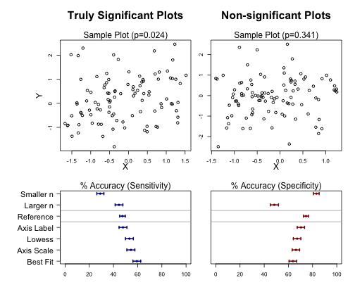
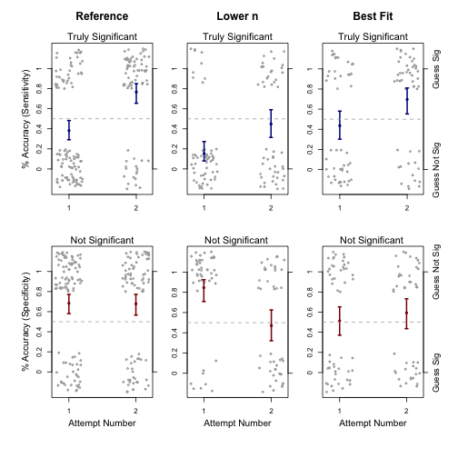

Supplemental Code
========================================================

This report was created using the knitr package (http://yihui.name/knitr/) in R (http://www.r-project.org/)


```r
# Initial Setup Note: Output from this code section has been masked for the
# sake of saving space.

library(plotrix)
library(lme4)

# Note to editor: Code book for these two files will be a part of the online
# supplement
x_full <- read.csv("tidyCourseraPval.csv", header = TRUE)  #user responses to coursera questions.
load("data_for_1plots_coursera.RData")  #objects describing the library of plots shown to users.

logit <- function(x) log(x/(1 - x))
invLogit <- function(x) {
    out <- exp(x)/(1 + exp(x))  #maintains the ability of the function to accept vectors
    out[exp(x) == Inf] <- 1
    return(out)
}
```


```r
# Output from this section has been masked)

# Process x_full

# re-order the style factor's levels so the reference category is first
uStyle <- unique(c("n100ref", as.character(x_full$style)))
x_full$style <- factor(as.character(x_full$style), levels = uStyle)
x_full$datVer <- as.factor(as.numeric(x_full$datVer))
x_full$id <- as.factor(as.numeric(x_full$id))
x_full$attemptNumFactor <- as.factor(as.numeric(x_full$attemptNum))

# preview x_full
dim(x_full)  #x_full includes everything, including missing data
head(x_full)  #note: styleNum values 2 & 3 are actually the same question style
lapply(x_full[1, ], class)
N <- sum(!is.na(x_full$guessSig))
n <- sum(!duplicated(x_full$id[!is.na(x_full$guessSig)]))
K <- length(uStyle)
N  #total # responses
n  #total # users
K  #total # of question types

# Make a version without missing data
x <- x_full[!is.na(x_full$guessSig), ]

# Get number of answers for each question type
nStyle <- c(table(x$style))[uStyle]
nStyle


uStyle
pretty_style_labels <- c("Reference", "Smaller n", "Larger n", "Best Fit", "Axis Scale", 
    "Axis Label", "Outlier", "Lowess")  #for use in plots
```


Models for Baseline Accuracy, and Effect of Plot Presentation Style
-----------------


```r
# Just look at first attempts of the survey
attemptNum1Data <- x[x$attemptNum == 1, ]


# Using 2 separate models, one for sensitivity, one for specificity (sense &
# spec)
sum(attemptNum1Data$trueSig)  # number of responses used in sense model = 9063
```

```
## [1] 9063
```

```r
sum(!attemptNum1Data$trueSig)  # number of responses used in spec model = 9032
```

```
## [1] 9032
```

```r

glmmSense = glmer(correct ~ 1 + (1 | id) + style, data = attemptNum1Data[attemptNum1Data$trueSig, 
    ], family = "binomial")  #Sensitivity model
glmmSpec = glmer(correct ~ 1 + (1 | id) + style, data = attemptNum1Data[!attemptNum1Data$trueSig, 
    ], family = "binomial")  #Specificity model

# Show basic output
print(glmmSense, correlation = FALSE)
```

```
## Generalized linear mixed model fit by the Laplace approximation 
## Formula: correct ~ 1 + (1 | id) + style 
##    Data: attemptNum1Data[attemptNum1Data$trueSig, ] 
##    AIC   BIC logLik deviance
##  12099 12163  -6041    12081
## Random effects:
##  Groups Name        Variance Std.Dev.
##  id     (Intercept) 0.397    0.63    
## Number of obs: 9063, groups: id, 2036
## 
## Fixed effects:
##                Estimate Std. Error z value Pr(>|z|)    
## (Intercept)     -0.1025     0.0472   -2.17  0.02985 *  
## stylen35        -0.7893     0.0839   -9.41  < 2e-16 ***
## stylen200       -0.1158     0.0790   -1.47  0.14252    
## stylebestFit     0.4805     0.0804    5.97  2.3e-09 ***
## styleaxesScale   0.2791     0.0806    3.46  0.00054 ***
## styleaxesLabel   0.0170     0.0791    0.21  0.82980    
## styleoutlier     1.0134     0.0840   12.07  < 2e-16 ***
## stylelowess      0.2297     0.0791    2.91  0.00367 ** 
## ---
## Signif. codes:  0 '***' 0.001 '**' 0.01 '*' 0.05 '.' 0.1 ' ' 1
```

```r
print(glmmSpec, correlation = FALSE)
```

```
## Generalized linear mixed model fit by the Laplace approximation 
## Formula: correct ~ 1 + (1 | id) + style 
##    Data: attemptNum1Data[!attemptNum1Data$trueSig, ] 
##    AIC   BIC logLik deviance
##  11120 11184  -5551    11102
## Random effects:
##  Groups Name        Variance Std.Dev.
##  id     (Intercept) 0.587    0.766   
## Number of obs: 9032, groups: id, 2032
## 
## Fixed effects:
##                Estimate Std. Error z value Pr(>|z|)    
## (Intercept)      1.0768     0.0543   19.83  < 2e-16 ***
## stylen35         0.5227     0.0982    5.32  1.0e-07 ***
## stylen200       -1.1401     0.0845  -13.49  < 2e-16 ***
## stylebestFit    -0.5112     0.0852   -6.00  2.0e-09 ***
## styleaxesScale  -0.4008     0.0853   -4.70  2.6e-06 ***
## styleaxesLabel  -0.2092     0.0885   -2.36    0.018 *  
## styleoutlier    -0.5294     0.0863   -6.13  8.7e-10 ***
## stylelowess     -0.3576     0.0869   -4.12  3.8e-05 ***
## ---
## Signif. codes:  0 '***' 0.001 '**' 0.01 '*' 0.05 '.' 0.1 ' ' 1
```

```r

# Get odds ratios and CIs
getORCIs <- function(model) {
    # logit(E(Y))=X*Beta; odds(E(Y))=exp(X*Beta)
    modelCoef <- fixef(model)
    modelSe <- sqrt(diag(vcov(model)))  #std error
    fit <- exp(modelCoef)
    li <- exp(modelCoef - qnorm(0.975) * modelSe)
    ui <- exp(modelCoef + qnorm(0.975) * modelSe)
    signif(cbind(fit, li, ui), 3)
}
getORCIs(glmmSense)
```

```
##                  fit    li    ui
## (Intercept)    0.903 0.823 0.990
## stylen35       0.454 0.385 0.535
## stylen200      0.891 0.763 1.040
## stylebestFit   1.620 1.380 1.890
## styleaxesScale 1.320 1.130 1.550
## styleaxesLabel 1.020 0.871 1.190
## styleoutlier   2.760 2.340 3.250
## stylelowess    1.260 1.080 1.470
```

```r
getORCIs(glmmSpec)
```

```
##                  fit    li    ui
## (Intercept)    2.940 2.640 3.260
## stylen35       1.690 1.390 2.040
## stylen200      0.320 0.271 0.377
## stylebestFit   0.600 0.508 0.709
## styleaxesScale 0.670 0.567 0.792
## styleaxesLabel 0.811 0.682 0.965
## styleoutlier   0.589 0.497 0.698
## stylelowess    0.699 0.590 0.829
```

```r

# Show variance explained by the random intercepts in each model Works
# specifically for binomial models
get_var_explained_by_rand_int <- function(model) {
    G <- attr(VarCorr(model)$id, "stddev")^2
    return(G/(G + (pi^2)/3))
}
# get_var_explained_by_rand_int(glmmInt)
get_var_explained_by_rand_int(glmmSense)
```

```
## (Intercept) 
##      0.1077
```

```r
get_var_explained_by_rand_int(glmmSpec)
```

```
## (Intercept) 
##      0.1515
```


Get confidence intervals and plot results

```r

#Generate Figure 1

#Function for generating confidence intervals for the fitted accuracy rates for each plot style;
#This function is meant to be used separately, for both the sensitivity and specificity models
getCIs<-function(model=glmmSense,plotInd=1:K,ci_width_scalar=1.96,plotIt=TRUE,axisLab=TRUE,cex.axis=1, ...){ #y can also be specificity
  #diag(vcov(model))
	#fixef(model)
	
	coefNames<-rep(NA,K)
	coefNames[1]<-'(Intercept)'
	coefNames[2:K]<-levels(x$style)[-1]
	modelCoef<-fixef(model)
	names(modelCoef)<-coefNames

	ui<- #upper CI (on probability/accuracy scale)
	li<- # Lower CI
	center<-rep(NA,8)
	for(k in 1:K){
		#let a be the vector such that crossprod(a,modelCoef) = intercept + coefficient[k]
		#abbreviate this crossproduct as 'af'
		a<-rep(0,K)
		names(a)<-coefNames
		a['(Intercept)']<-1
		if(k>1) a[coefNames[k]]<-1
		var_af<- t(a) %*% vcov(model) %*% a
		se_af<-sqrt(as.numeric(var_af))
		center_logOdds <- t(a)%*%modelCoef
		ui[k]<- invLogit( center_logOdds + ci_width_scalar*se_af)
		li[k]<- invLogit( center_logOdds - ci_width_scalar*se_af)
		center[k]<- invLogit(center_logOdds)
	}	

	if(plotIt){
		plotCI(x=center[plotInd]*100,y=(length(plotInd)):1,ui=ui[plotInd]*100,li=li[plotInd]*100,pch=19,cex=.5,yaxt='n',err='x',ylab='', ...)
		if(axisLab) axis(2, at=1:(length(plotInd)), labels=pretty_style_labels[plotInd][(length(plotInd)):1],cex.axis=cex.axis,las=2) #need to reorder labels so they go down, not up
	}
	
	return(cbind(center,ui,li,modelCoef))
}

########
#Generate Figure 1

par(mar=c(5,2,1,1),oma=c(1,7,5,1))
layoutMat<-cbind(rep(c(1,3),c(4,3)),rep(c(2,4),c(4,3)))
layout(layoutMat)

#Make example plots from the reference category, one significant and one not
plotSigRefInd<-which(pres=='n100ref'&pvals<.05)[4]
plotNotSigRefInd<-which(pres=='n100ref'&pvals>=.05)[4]

plot(xes[plotSigRefInd,],yes[plotSigRefInd,],xlab='',ylab='')
mtext('Truly Significant Plots',3,line=3,font=2,cex=1.3)
mtext(paste0('Sample Plot (p=',round(pvals[plotSigRefInd],3),')'),3,line=.2,font=1)
mtext('X',1,line=2)
mtext('Y',2,line=2.5)

plot(xes[plotNotSigRefInd,],yes[plotNotSigRefInd,],xlab='',ylab='')
mtext('Non-significant Plots',3,line=3,font=2,cex=1.3)
mtext(paste0('Sample Plot (p=',round(pvals[plotNotSigRefInd],3),')'),3,line=.2,font=1)
mtext('X',1,line=2)

#plot confidence intervals for fitted accuracy
plotInd4CIfig_pre<-order(fixef(glmmSense)) #order plots by sense coef
plotInd4CIfig<-plotInd4CIfig_pre[plotInd4CIfig_pre!=7] #dropping outlier from plot
getCIs(glmmSense,plotInd=plotInd4CIfig,col=c("darkblue"),main='',xlab='',xlim=c(0,100),cex.axis=1.4,lwd=2)
```

```
##             center     ui     li modelCoef
## (Intercept) 0.4744 0.4975 0.4514   -0.1025
## n35         0.2907 0.3207 0.2625   -0.7893
## n200        0.4456 0.4779 0.4138   -0.1158
## bestFit     0.5934 0.6251 0.5609    0.4805
## axesScale   0.5440 0.5770 0.5107    0.2791
## axesLabel   0.4786 0.5112 0.4463    0.0170
## outlier     0.7132 0.7412 0.6834    1.0134
## lowess      0.5317 0.5640 0.4992    0.2297
```

```r
mtext('% Accuracy (Sensitivity)', side=3, line=.2)
abline(h=4.5,lty=1,col='darkgray')
abline(h=5.5,lty=1,col='darkgray')
getCIs(glmmSpec,plotInd=plotInd4CIfig,col=c("darkred"),axisLab=FALSE,main='',xlab='',xlim=c(0,100),lwd=2)
```

```
##             center     ui     li modelCoef
## (Intercept) 0.7459 0.7655 0.7252    1.0768
## n35         0.8319 0.8541 0.8072    0.5227
## n200        0.4842 0.5180 0.4505   -1.1401
## bestFit     0.6377 0.6688 0.6055   -0.5112
## axesScale   0.6628 0.6928 0.6315   -0.4008
## axesLabel   0.7042 0.7335 0.6732   -0.2092
## outlier     0.6335 0.6654 0.6005   -0.5294
## lowess      0.6724 0.7027 0.6406   -0.3576
```

```r
abline(h=4.5,lty=1,col='darkgray')
abline(h=5.5,lty=1,col='darkgray')
mtext('% Accuracy (Specificity)', side=3, line=.2)
```

 

```r
########
```


Models for Learning
---------------


```r
# select users who did the survey at least twice, but exclude questions they
# saw twice.
users_with_multiple_tries <- unique(x$id[x$attemptNum > 1])
multi_try_data_ind <- x$id %in% users_with_multiple_tries
multi_try_data <- x[multi_try_data_ind & x$firstTry, ]


# Calculate the percent of second attempts were discarded because users saw
# a duplicate plot
1 - sum(multi_try_data_ind & x$firstTry)/sum(multi_try_data_ind)
```

```
## [1] 0.1279
```

```r

cut = 2  #cutoff point for max # of tries in our model (only look at first and second attempts)
multi_try_data_sense_leq_cut <- multi_try_data[multi_try_data$attemptNum <= 
    cut & multi_try_data$trueSig, ]
multi_try_data_spec_leq_cut <- multi_try_data[multi_try_data$attemptNum <= cut & 
    !multi_try_data$trueSig, ]

# Fit random intercept model
dim(multi_try_data_sense_leq_cut)  #846 = # responses in model
```

```
## [1] 846  15
```

```r
glmmSenseLearn_rIntercept = glmer(correct ~ 1 + (1 | id) + attemptNumFactor * 
    style, data = multi_try_data_sense_leq_cut, family = "binomial")  # Fit model with interaction terms
print(glmmSenseLearn_rIntercept, correlation = FALSE)
```

```
## Generalized linear mixed model fit by the Laplace approximation 
## Formula: correct ~ 1 + (1 | id) + attemptNumFactor * style 
##    Data: multi_try_data_sense_leq_cut 
##   AIC  BIC logLik deviance
##  1131 1212   -549     1097
## Random effects:
##  Groups Name        Variance Std.Dev.
##  id     (Intercept) 0.147    0.383   
## Number of obs: 846, groups: id, 101
## 
## Fixed effects:
##                                  Estimate Std. Error z value Pr(>|z|)    
## (Intercept)                        -0.480      0.209   -2.30  0.02147 *  
## attemptNumFactor2                   1.663      0.343    4.85  1.2e-06 ***
## stylen35                           -1.231      0.424   -2.90  0.00372 ** 
## stylen200                           0.422      0.345    1.22  0.22207    
## stylebestFit                        0.220      0.359    0.61  0.53927    
## styleaxesScale                      0.401      0.336    1.20  0.23207    
## styleaxesLabel                      0.228      0.359    0.64  0.52499    
## styleoutlier                        0.947      0.368    2.57  0.01012 *  
## stylelowess                         0.729      0.359    2.03  0.04228 *  
## attemptNumFactor2:stylen35         -0.157      0.583   -0.27  0.78771    
## attemptNumFactor2:stylen200        -1.316      0.547   -2.40  0.01625 *  
## attemptNumFactor2:stylebestFit     -0.573      0.551   -1.04  0.29857    
## attemptNumFactor2:styleaxesScale   -0.985      0.537   -1.84  0.06635 .  
## attemptNumFactor2:styleaxesLabel   -1.531      0.562   -2.72  0.00648 ** 
## attemptNumFactor2:styleoutlier     -1.698      0.546   -3.11  0.00186 ** 
## attemptNumFactor2:stylelowess      -2.055      0.544   -3.78  0.00016 ***
## ---
## Signif. codes:  0 '***' 0.001 '**' 0.01 '*' 0.05 '.' 0.1 ' ' 1
```

```r

dim(multi_try_data_spec_leq_cut)  #859 = # responses in model
```

```
## [1] 859  15
```

```r
glmmSpecLearn_rIntercept = glmer(correct ~ 1 + (1 | id) + attemptNumFactor * 
    style, data = multi_try_data_spec_leq_cut, family = "binomial")  #
print(glmmSpecLearn_rIntercept, correlation = FALSE)
```

```
## Generalized linear mixed model fit by the Laplace approximation 
## Formula: correct ~ 1 + (1 | id) + attemptNumFactor * style 
##    Data: multi_try_data_spec_leq_cut 
##   AIC  BIC logLik deviance
##  1152 1232   -559     1118
## Random effects:
##  Groups Name        Variance Std.Dev.
##  id     (Intercept) 0.447    0.668   
## Number of obs: 859, groups: id, 101
## 
## Fixed effects:
##                                  Estimate Std. Error z value Pr(>|z|)    
## (Intercept)                        0.7709     0.2289    3.37  0.00076 ***
## attemptNumFactor2                 -0.0269     0.3212   -0.08  0.93324    
## stylen35                           0.9280     0.4621    2.01  0.04461 *  
## stylen200                         -1.4387     0.3855   -3.73  0.00019 ***
## stylebestFit                      -0.7215     0.3616   -2.00  0.04603 *  
## styleaxesScale                    -0.8237     0.3933   -2.09  0.03624 *  
## styleaxesLabel                    -0.1336     0.3751   -0.36  0.72172    
## styleoutlier                      -0.2601     0.3728   -0.70  0.48532    
## stylelowess                       -0.8086     0.3623   -2.23  0.02564 *  
## attemptNumFactor2:stylen35        -1.7888     0.6074   -2.94  0.00323 ** 
## attemptNumFactor2:stylen200        0.8340     0.5399    1.54  0.12239    
## attemptNumFactor2:stylebestFit     0.3513     0.5338    0.66  0.51042    
## attemptNumFactor2:styleaxesScale   0.0017     0.5409    0.00  0.99749    
## attemptNumFactor2:styleaxesLabel  -0.6149     0.5268   -1.17  0.24307    
## attemptNumFactor2:styleoutlier    -0.7241     0.5526   -1.31  0.19009    
## attemptNumFactor2:stylelowess      0.0855     0.5214    0.16  0.86981    
## ---
## Signif. codes:  0 '***' 0.001 '**' 0.01 '*' 0.05 '.' 0.1 ' ' 1
```

```r


# Show variance explained by random intercepts
get_var_explained_by_rand_int(glmmSenseLearn_rIntercept)
```

```
## (Intercept) 
##     0.04266
```

```r
get_var_explained_by_rand_int(glmmSpecLearn_rIntercept)
```

```
## (Intercept) 
##      0.1196
```

```r

# Get CIs for learning models Get confidence intervals for the fitted
# accuracy rates for each combination of style and attempt number in the
# learning model.  Also get confidence intervals for odds ratios for the
# learning effect in each category.  To get interpretation of effect of
# attemptNo, we need to add attemptNum coeff to interaction terms.  Negative
# interaction just means that the learning effect is less strong than in the
# reference category. The function below returns a list of CI matrixes for
# each style, with rows for attemptNum.
getCIlearn <- function(model, ci_width_scalar = 1.96, test_type = "two_sided") {
    
    modelCoef <- fixef(model)
    coefNames <- names(modelCoef)
    
    # find value of 'cut' (max attemptNum in model)
    cut = length(coefNames)/K  #K = number of categories for each attemptNum
    
    # list output by style
    CImats <- list()
    
    for (k in 1:K) {
        k_mat <- matrix(NA, cut, 8)
        colnames(k_mat) <- c("centerProb", "liProb", "uiProb", "centerOR", "liOR", 
            "uiOR", "zstat", "p_value")  #we'll add this to CImats later
        # attemptNum is the row index of k_mat
        for (no in 1:cut) {
            # a vector to multiply by the model coefficients
            a <- rep(0, times = length(coefNames))
            names(a) <- coefNames
            a["(Intercept)"] <- 1
            if (k > 1) 
                a[paste0("style", uStyle[k])] <- 1
            if (no > 1) 
                a[paste0("attemptNumFactor", no)] <- 1
            if (k > 1 & no > 1) 
                a[paste0("attemptNumFactor", no, ":style", uStyle[k])] <- 1
            
            # let a be the vector such that a'modelCoef = intercept + coefficient k
            # abbreviate this t(a)%*%modelCoef as af
            var_af <- t(a) %*% vcov(model) %*% a
            se_af <- sqrt(as.numeric(var_af))
            
            center_logOdds <- crossprod(a, modelCoef)
            k_mat[no, "uiProb"] <- invLogit(center_logOdds + ci_width_scalar * 
                se_af)
            k_mat[no, "liProb"] <- invLogit(center_logOdds - ci_width_scalar * 
                se_af)
            k_mat[no, "centerProb"] <- invLogit(center_logOdds)
            
            
            # pvalues need to be calculated the same way, but without the intercept
            # term, and without the baseline style term. Get dist of
            # 'wf'=t(w)%*%coefficients, wwhere w is a vector similar to 'a', above.
            if (no == 1) 
                next  #This not relevant if a attemptNum=1
            
            w <- rep(0, times = length(coefNames))
            names(w) <- coefNames
            w[paste0("attemptNumFactor", no)] <- 1
            if (k > 1) 
                w[paste0("attemptNumFactor", no, ":style", uStyle[k])] <- 1
            
            var_wf <- t(w) %*% vcov(model) %*% w
            se_wf <- sqrt(as.numeric(var_wf))
            
            k_mat[no, "centerOR"] <- exp(crossprod(w, modelCoef))
            k_mat[no, "uiOR"] <- exp(crossprod(w, modelCoef) + ci_width_scalar * 
                se_wf)
            k_mat[no, "liOR"] <- exp(crossprod(w, modelCoef) - ci_width_scalar * 
                se_wf)
            
            zstat <- t(w) %*% modelCoef/se_wf
            if (test_type == "two_sided") 
                p_value <- 2 * (1 - pnorm(abs(zstat)))
            if (test_type == "one_sided_up") 
                p_value <- (1 - pnorm(zstat))
            if (test_type == "one_sided_down") 
                p_value <- pnorm(zstat)
            k_mat[no, "zstat"] <- zstat
            k_mat[no, "p_value"] <- p_value
            
        }
        CImats[[uStyle[k]]] <- k_mat
    }
    return(CImats)
}

# Show confidence intervals for odds ratios regarding the learning effect,
# for each category.
getCIlearn(glmmSenseLearn_rIntercept)
```

```
## $n100ref
##      centerProb liProb uiProb centerOR  liOR  uiOR zstat   p_value
## [1,]     0.3821 0.2911 0.4823       NA    NA    NA    NA        NA
## [2,]     0.7654 0.6545 0.8489    5.274 2.693 10.33 4.848 1.248e-06
## 
## $n35
##      centerProb liProb uiProb centerOR  liOR  uiOR zstat  p_value
## [1,]     0.1529 0.0799 0.2729       NA    NA    NA    NA       NA
## [2,]     0.4487 0.3144 0.5909    4.508 1.787 11.37  3.19 0.001422
## 
## $n200
##      centerProb liProb uiProb centerOR   liOR  uiOR  zstat p_value
## [1,]     0.4853 0.3525 0.6203       NA     NA    NA     NA      NA
## [2,]     0.5717 0.4132 0.7167    1.415 0.6133 3.266 0.8141  0.4156
## 
## $bestFit
##      centerProb liProb uiProb centerOR  liOR  uiOR zstat p_value
## [1,]     0.4354 0.3011 0.5798       NA    NA    NA    NA      NA
## [2,]     0.6964 0.5523 0.8101    2.975 1.279 6.919 2.532 0.01134
## 
## $axesScale
##      centerProb liProb uiProb centerOR   liOR  uiOR zstat p_value
## [1,]     0.4802 0.3532 0.6097       NA     NA    NA    NA      NA
## [2,]     0.6452 0.4937 0.7723    1.969 0.8768 4.422 1.642  0.1007
## 
## $axesLabel
##      centerProb liProb uiProb centerOR   liOR  uiOR  zstat p_value
## [1,]     0.4373 0.3028 0.5816       NA     NA    NA     NA      NA
## [2,]     0.4700 0.3145 0.6316    1.141 0.4764 2.735 0.2968  0.7666
## 
## $outlier
##      centerProb liProb uiProb centerOR   liOR  uiOR    zstat p_value
## [1,]     0.6147 0.4658 0.7448       NA     NA    NA       NA      NA
## [2,]     0.6063 0.4636 0.7330   0.9656 0.4208 2.216 -0.08251  0.9342
## 
## $lowess
##      centerProb liProb uiProb centerOR   liOR  uiOR   zstat p_value
## [1,]     0.5618 0.4174 0.6964       NA     NA    NA      NA      NA
## [2,]     0.4641 0.3227 0.6115   0.6755 0.2952 1.546 -0.9286  0.3531
```

```r
getCIlearn(glmmSpecLearn_rIntercept)
```

```
## $n100ref
##      centerProb liProb uiProb centerOR   liOR  uiOR    zstat p_value
## [1,]     0.6837 0.5799 0.7720       NA     NA    NA       NA      NA
## [2,]     0.6779 0.5659 0.7726   0.9735 0.5187 1.827 -0.08377  0.9332
## 
## $n35
##      centerProb liProb uiProb centerOR    liOR   uiOR  zstat   p_value
## [1,]     0.8454 0.7090 0.9246       NA      NA     NA     NA        NA
## [2,]     0.4708 0.3218 0.6252   0.1627 0.05929 0.4466 -3.525 0.0004238
## 
## $n200
##      centerProb liProb uiProb centerOR   liOR  uiOR zstat p_value
## [1,]     0.3390 0.2138 0.4917       NA     NA    NA    NA      NA
## [2,]     0.5348 0.3879 0.6758    2.241 0.9578 5.245 1.861 0.06281
## 
## $bestFit
##      centerProb liProb uiProb centerOR   liOR  uiOR  zstat p_value
## [1,]     0.5123 0.3707 0.6521       NA     NA    NA     NA      NA
## [2,]     0.5924 0.4359 0.7321    1.383 0.5995 3.191 0.7606  0.4469
## 
## $axesScale
##      centerProb liProb uiProb centerOR   liOR  uiOR    zstat p_value
## [1,]     0.4868 0.3304 0.6458       NA     NA    NA       NA      NA
## [2,]     0.4805 0.3422 0.6218   0.9751 0.4157 2.287 -0.05794  0.9538
## 
## $axesLabel
##      centerProb liProb uiProb centerOR   liOR  uiOR  zstat p_value
## [1,]     0.6541 0.5066 0.7770       NA     NA    NA     NA      NA
## [2,]     0.4989 0.3594 0.6385   0.5263 0.2321 1.193 -1.537  0.1244
## 
## $outlier
##      centerProb liProb uiProb centerOR   liOR  uiOR  zstat p_value
## [1,]     0.6250 0.4764 0.7532       NA     NA    NA     NA      NA
## [2,]     0.4402 0.2891 0.6033   0.4719 0.1957 1.138 -1.672 0.09444
## 
## $lowess
##      centerProb liProb uiProb centerOR   liOR  uiOR  zstat p_value
## [1,]     0.4906 0.3504 0.6322       NA     NA    NA     NA      NA
## [2,]     0.5052 0.3622 0.6473     1.06 0.4739 2.372 0.1425  0.8867
```


Generate Figure 2


```r


# Make figure 2

# Function for adding jittered background points to a plot.
plot_pts_for_CI_plot <- function(plotStyle = "n100ref", type = "sense", data = multi_try_data, 
    cut = cut, jit_factor_x = 1.2, jit_factor_y = 1.2, y2lab, ...) {
    # style %in% plotStyle lets us use the same function for an aggregate plot
    ind1 <- data$attemptNum <= cut
    ind2 <- !data$trueSig
    if (type == "sense") 
        ind2 <- data$trueSig
    ind3 <- data$style %in% plotStyle
    d <- data[ind1 & ind2 & ind3, ]
    plot(jitter(d$attemptNum, factor = jit_factor_x), jitter(d$correct + 0, 
        factor = jit_factor_y), col = "darkgray", cex = 0.5, xaxt = "n", yaxt = "n", 
        ...)
    axis(4, at = 0:1, labels = y2lab, cex.axis = 1.2)
}

# Function for adding CIs to a plot (CIs for accuracy)
add2plot_LearnCImats <- function(ciMat, ...) {
    cut <- dim(ciMat)[1]
    plotCI(x = 1:cut, y = ciMat[, "centerProb"], ui = ciMat[, "uiProb"], li = ciMat[, 
        "liProb"], pch = 19, cex = 0.5, add = TRUE, ...)
    axis(1, at = (1:cut), labels = 1:cut)  #need to reorder labels so they go down, not up
    yLabels <- seq(0, 1, length = 6)
    axis(2, at = yLabels, labels = yLabels)  #need to reorder labels so they go down, not up
    abline(h = 0.5, lty = 2, col = "darkgray")
}

# SENSE
ciMat_learn_sense <- getCIlearn(glmmSenseLearn_rIntercept)

par(mfrow = c(2, 3), mar = c(4, 3, 2, 1), oma = c(3, 3, 3, 3))
plot_pts_for_CI_plot(plotStyle = "n100ref", type = "sense", cut = cut, jit_factor_x = 1, 
    jit_factor_y = 1, y2lab = c("", ""), xlab = "", ylab = "")
add2plot_LearnCImats(ciMat_learn_sense[["n100ref"]], col = "darkblue", lwd = 2)
mtext(text = "% Accuracy (Sensitivity)", side = 2, line = 2.5, cex = 0.85)
mtext(text = "Reference", side = 3, line = 2.5, font = 2)
mtext(text = "Truly Significant", side = 3, line = 0.2, cex = 0.899)

plot_pts_for_CI_plot(plotStyle = "n35", type = "sense", cut = cut, jit_factor_x = 1, 
    jit_factor_y = 1, y2lab = c("", ""), ylab = "", xlab = "")
add2plot_LearnCImats(ciMat_learn_sense[["n35"]], main = "Lower n", col = "darkblue", 
    lwd = 2)
mtext(text = "Lower n", side = 3, line = 2.5, font = 2)
mtext(text = "Truly Significant", side = 3, line = 0.2, cex = 0.899)

plot_pts_for_CI_plot(plotStyle = "bestFit", type = "sense", cut = cut, jit_factor_x = 1, 
    jit_factor_y = 1, xlab = "", ylab = "", y2lab = c("Guess Not Sig", "Guess Sig"))
add2plot_LearnCImats(ciMat_learn_sense[["bestFit"]], main = "Best-fit Line", 
    col = "darkblue", ylab = "", lwd = 2, xlab = "")
mtext(text = "Best Fit", side = 3, line = 2.5, font = 2)
mtext(text = "Truly Significant", side = 3, line = 0.2, cex = 0.899)


# SPEC
ciMat_learn_spec <- getCIlearn(glmmSpecLearn_rIntercept)

plot_pts_for_CI_plot(plotStyle = "n100ref", type = "spec", xlab = "", ylab = "", 
    cut = cut, jit_factor_x = 1, jit_factor_y = 1, y2lab = c("", ""))
add2plot_LearnCImats(ciMat_learn_spec[["n100ref"]], main = "", col = "darkred", 
    ylab = "Specificity", ylim = c(-0.2, 1.2), xlim = c(0.5, cut + 0.5), lwd = 2)
mtext(text = "Not Significant", side = 3, line = 0.2, cex = 0.899)
mtext(text = "% Accuracy (Specificity)", side = 2, line = 2.5, cex = 0.85)
mtext(text = "Attempt Number", side = 1, line = 2.5, cex = 0.85)

plot_pts_for_CI_plot(plotStyle = "n35", type = "spec", xlab = "", ylab = "", 
    cut = cut, jit_factor_x = 1, jit_factor_y = 1, y2lab = c("", ""))
add2plot_LearnCImats(ciMat_learn_spec[["n35"]], main = "", col = "darkred", 
    ylab = "", ylim = c(-0.2, 1.2), xlim = c(0.5, cut + 0.5), lwd = 2)
mtext(text = "Not Significant ", side = 3, line = 0.2, cex = 0.899)
mtext(text = "Attempt Number", side = 1, line = 2.5, cex = 0.85)

plot_pts_for_CI_plot(plotStyle = "bestFit", type = "spec", main = "", xlab = "", 
    cut = cut, jit_factor_x = 1, jit_factor_y = 1, ylab = "", y2lab = c("Guess Sig", 
        "Guess Not Sig"))
add2plot_LearnCImats(ciMat_learn_spec[["bestFit"]], main = "", col = "darkred", 
    lwd = 2)
mtext(text = "Not Significant ", side = 3, line = 0.2, cex = 0.899)
mtext(text = "Attempt Number", side = 1, line = 2.5, cex = 0.85)
```

 

```r

```


